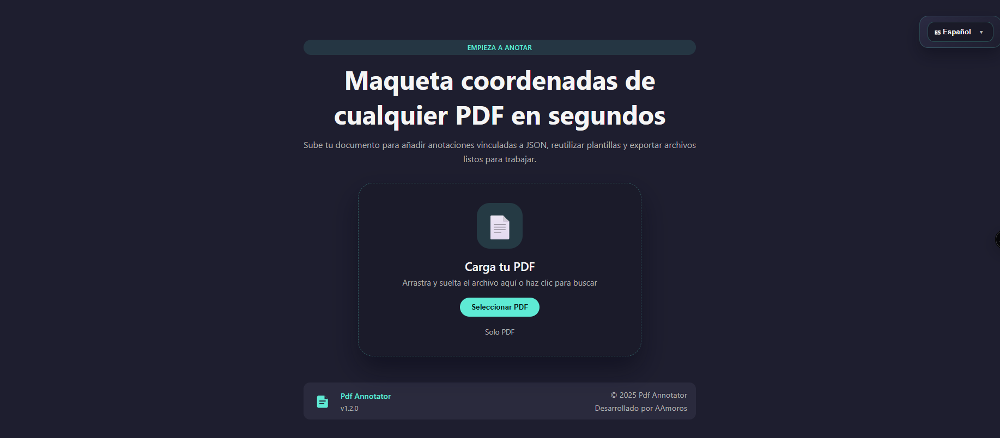
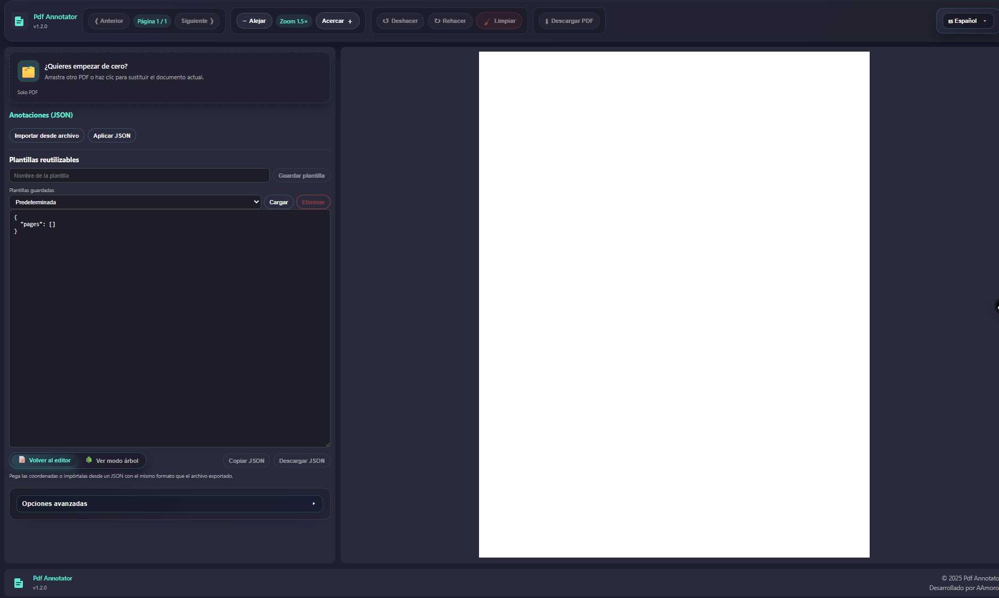
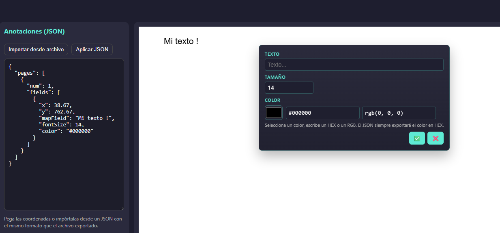

<p align="center">
  
</p>

<h1 align="center">📑 PDF Annotator</h1>

<p align="center">
  Herramienta web en <strong>Angular 20</strong> para crear, editar y exportar anotaciones sobre cualquier PDF sin alterar el archivo original.
</p>

<p align="center">
  <a href="#-caracteristicas-destacadas"></a>
  <a href="https://github.com/ElMaxter99/pdf-annotator/issues/new/choose"></a>
</p>

---

## 📚 Tabla de contenidos
- [📚 Tabla de contenidos](#-tabla-de-contenidos)
- [✨ Características destacadas](#-características-destacadas)
- [🧰 Stack tecnológico](#-stack-tecnológico)
- [🛠 Requisitos](#-requisitos)
- [⚙ Instalación](#-instalación)
- [🚀 Despliegue con Docker](#-despliegue-con-docker)
- [▶ Uso paso a paso](#-uso-paso-a-paso)
  - [1. Inicia el servidor de desarrollo](#1-inicia-el-servidor-de-desarrollo)
  - [2. Carga un PDF](#2-carga-un-pdf)
  - [3. Navega y ajusta el zoom](#3-navega-y-ajusta-el-zoom)
  - [4. Crea una anotación](#4-crea-una-anotación)
  - [5. Edita o mueve anotaciones](#5-edita-o-mueve-anotaciones)
  - [6. Controla el color y la tipografía](#6-controla-el-color-y-la-tipografía)
  - [7. Gestiona las anotaciones en JSON](#7-gestiona-las-anotaciones-en-json)
  - [8. Exporta un PDF anotado](#8-exporta-un-pdf-anotado)
  - [9. Atajos de teclado](#9-atajos-de-teclado)
  - [10. Formato de las coordenadas](#10-formato-de-las-coordenadas)
- [📸 Galería](#-galería)
- [🧰 Solución de problemas](#-solución-de-problemas)
- [🧱 Plantillas para contribuir](#-plantillas-para-contribuir)
- [📝 Licencia](#-licencia)

## ✨ Características destacadas
- 🎯 **Anotaciones precisas**: define posición, color y tipografía sobre un lienzo sincronizado con cada página.
- 🔁 **Edición en vivo**: arrastra tarjetas, actualiza el texto y visualiza los cambios sin refrescar el PDF.
- 💾 **Gestión de datos**: importa/exporta anotaciones en JSON normalizado o descarga un PDF con las marcas aplicadas.
- ⚡ **Experiencia fluida**: atajos de teclado, zoom incremental y feedback instantáneo en el panel lateral.
- 🧪 **Flujos listos para QA**: reproduce escenarios con JSON compartible para validar diseños y firmas.

## 🧰 Stack tecnológico
| Frontend | Renderizado PDF | Utilidades |
| --- | --- | --- |
| Angular 20 · RxJS · Angular Material | pdf-lib · pdfjs-dist | TypeScript · Sass · Vite dev server |

> El repositorio incluye scripts para validar traducciones (`npm run i18n:check`) antes de construir la aplicación.

## 🛠 Requisitos
- Node.js **v22.12.0** (o compatible con Angular 20).
- Angular CLI **v20.2.0** instalado globalmente (`npm install -g @angular/cli`) o disponible vía `npx`.
- Navegador moderno con soporte para ES2022.

## ⚙ Instalación
```bash
# Clona el repositorio
git clone https://github.com/ElMaxter99/pdf-annotator.git
cd pdf-annotator

# Instala las dependencias
npm install
```

### ▶️ Ejecuta la app en tu máquina (Node 22)

```bash
npm run start:local
```

El servidor de desarrollo queda disponible en `http://localhost:4200` con soporte para hot-reload. Si faltan dependencias críticas de Angular (por ejemplo `@angular/build`), el script se detiene con un aviso para que ejecutes `npm install` manualmente antes de volver a lanzar `ng serve`; así evitas el error `Could not find the '@angular/build:dev-server' builder's node package.` típico de los entornos recién clonados.

> ¿Tu equipo no puede instalar Node.js 22 o Angular 20? Ejecuta la versión en contenedor.

### 🐳 Ejecuta la app con Docker (alternativa)

```bash
npm run start:docker
```

El comando delega en `scripts/docker-up.sh` para construir la imagen y exponer la SPA en `http://localhost:4444`.

## 🚀 Despliegue con Docker
> Requiere Docker Desktop, Docker Engine o una instalación compatible con Docker Compose.

```bash
npm run start:docker
```

El script compila la aplicación con Node.js 22.12.0, construye la imagen `pdf-annotator:latest` y levanta el servicio detrás de NGINX. Una vez completado, la SPA queda disponible en `http://localhost:4444`.

Para detener y limpiar los contenedores:

```bash
sh scripts/docker-down.sh
```

Al finalizar, la aplicación dejará de estar disponible en `http://localhost:4444`.

## ▶ Uso paso a paso
### 1. Inicia el servidor de desarrollo
```bash
npm run start:local
```
Abre `http://localhost:4200` en tu navegador (o la IP indicada si usaste otro host).

### 2. Carga un PDF
Haz clic en **Seleccionar PDF** y elige un archivo `.pdf`. El visor mostrará la primera página y habilitará el panel de anotaciones.

### 3. Navega y ajusta el zoom
- Usa **◀ / ▶** para cambiar de página.
- Ajusta el zoom con los botones `−` y `+` (pasos de 0.25x). El escalado se aplica tanto al PDF como a las anotaciones ya dibujadas.

### 4. Crea una anotación
1. Haz clic sobre el documento (capa transparente "Hitbox").
2. En la tarjeta flotante escribe el texto que quieres mostrar (`mapField`).
3. Ajusta el tamaño de fuente (8–72 px) y selecciona un color desde el selector o introduciendo valores hex (`#RRGGBB`) o RGB (`rgb(r, g, b)`).
4. Pulsa ✅ para confirmar o ❌ para cancelar.

### 5. Edita o mueve anotaciones
- Haz clic sobre una anotación existente para abrir el editor en modo **Edición**.
- Arrastra la tarjeta para reposicionarla; el sistema recalcula las coordenadas en tiempo real.
- Modifica texto, tamaño o color y confirma con ✅. Usa 🗑️ para eliminar la marca.

### 6. Controla el color y la tipografía
El panel de edición sincroniza automáticamente el selector de color, la entrada hexadecimal y la representación RGB. Cambiar cualquiera actualiza las otras. El tamaño de fuente se guarda en puntos (`fontSize`).

### 7. Gestiona las anotaciones en JSON
- **Panel lateral**: visualiza y edita el JSON en vivo. Puedes pegar datos y aplicar cambios con **Aplicar JSON**.
- **Copiar JSON**: copia el objeto `{ pages: [...] }` al portapapeles.
- **Descargar JSON**: guarda las coordenadas como `coords.json`.
- **Importar JSON**: carga un archivo externo desde el botón del panel.
- El sistema acepta tanto un array directo como un objeto `{ "pages": [...] }` y normaliza coordenadas, textos y colores.

### 8. Exporta un PDF anotado
Con al menos una anotación y un PDF cargado:
1. Haz clic en **Descargar PDF anotado**.
2. La app reutiliza los bytes del archivo original, renderiza las marcas con `pdf-lib` (tipografía Helvetica) y descarga `annotated.pdf`.

### 9. Atajos de teclado
- **Enter** confirma la anotación en curso (creación o edición).
- **Escape** cancela la tarjeta activa.

### 10. Formato de las coordenadas
Cada anotación se almacena como:
```json
{
  "pages": [
    {
      "num": 1,
      "fields": [
        {
          "x": 120.5,
          "y": 450.25,
          "mapField": "Firma",
          "fontSize": 14,
          "color": "#FF0000"
        }
      ]
    }
  ]
}
```
- `x` e `y` están en puntos PDF (origen en la esquina inferior izquierda).
- `mapField` corresponde al texto que se pintará sobre el documento.
- `fontSize` se almacena en puntos; si no se indica, la app usa 14.
- `color` acepta hexadecimales (`#RRGGBB`).

## 📸 Galería
<p align="center" style="display: flex; justify-content: center; gap: 10px; flex-wrap: wrap;">
  
  
  
</p>


## 🧰 Solución de problemas
- **El PDF no se renderiza**: revisa que el archivo no esté protegido y que el servidor de desarrollo muestre el log sin errores.
- **No puedo mover una anotación**: asegúrate de arrastrar desde el cuerpo de la tarjeta (no solo desde los campos de texto).
- **Error al importar JSON**: confirma que el archivo contenga la estructura indicada y que los valores numéricos sean válidos.
- **El PDF exportado no abre**: prueba con otra copia del PDF original; la app intenta tres variantes (original, canónica y saneada) para asegurar compatibilidad.

## 🧱 Plantillas para contribuir
El repositorio incluye plantillas en `.github/`:

- `ISSUE_TEMPLATE/bug_report.md`: guía para reportar errores con pasos reproducibles.
- `ISSUE_TEMPLATE/feature_request.md`: estructura sugerencias de mejora con contexto y alcance.
- `PULL_REQUEST_TEMPLATE.md`: checklist para documentar pruebas y evidencia de los cambios.

Además, en la pestaña **About** del repositorio puedes añadir etiquetas (Angular, PDF, annotations) y la URL de la demo para mejorar la visibilidad.

## 📝 Licencia
MIT © 2025 AlvaroMaxter
# redeploy
